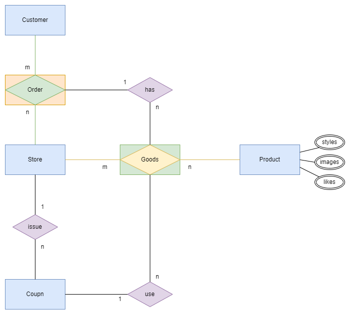

# Data Model

## Requirements (需求分析)

- 一個賣場 `Store` 可以上架多件商品 `Products`，可販售產品視為現貨商品 `Item`。
- 一件商品 `Product` 可以在多個賣場 `Stores` 販售，賣場包含實體商店與網路平台。
- 每件商品 `Product` 包含商品名稱 `title`、定價 `price`、樣式顏色 `styles`、展示圖片 `images`、及顧客按讚數 `Likes`。
- 每個賣場 `Store` 會發行 (`issue`) 自己的折價券 `Coupon`。
- 顧客 `Consumer` 可以使用 (`use`) 賣場折價券，對購買現貨商品定價進行折扣。
- 顧客 `Consumer` 可以對賣場 `Store` 下訂單 `Item`。
- 訂單 `Order` 會紀錄所購買的現貨商品 `Item` 明細，且每件現貨可以單獨使用賣場折價券 `Coupon`。

## Data Modeling (資料塑模)

此為概念設計，產出 `ER Model`。

註：

- 資料模型係將真實世界按著需求抽象化塑模而成，概念型模型較不需包含實體欄位細節 (非關注點)。
- 假如概念設計階段有設計好，理論上既已符合 `3NF` 正規化，倒是設計出來後可能會切得過細，應視需要 `反正規化`。
- 內部使用到實體關係圖 (長方形 + 菱形)，表達其既是實體 `Entity` 又是關係 `Relationship`，其可表現實體關係建立的先後順序，例如無賣場或無顧客任一，則必定無法下訂單，且訂單無法憑空產生，故其表達力較強，不需依賴弱實體。

## 邏輯設計與實體設計

邏輯設計詳 `ORM` ../model/shopping)

## 實體設計

| Table  | Field      | Data Type    | Index      | Reference |
| ------ | ---------- | ------------ | ---------- | --------- |
| stores | id         | MEDIUMINT(8) | PrimaryKey |           |
|        | created_at | DATETIME     |            |           |
|        | updated_at | DATETIME     |            |           |
|        | deleted_at | DATETIME     | Index      |           |
|        | title      | VARCHAR(255) |            |           |

| Table   | Field      | Data Type    | Index      | Reference |
| ------- | ---------- | ------------ | ---------- | --------- |
| coupons | id         | MEDIUMINT(8) | PrimaryKey |           | 
|         | created_at | DATETIME     |            |           | 
|         | updated_at | DATETIME     |            |           | 
|         | deleted_at | DATETIME     | Index      |           | 
|         | title      | VARCHAR(255) |            |           | 
|         | discount   | DOUBLE(10,4) |            |           | 
|         | store_id   | MEDIUMINT(8) | ForeignKey | stores.id |

| Table    | Field      | Data Type    | Index      | Reference |
| -------- | ---------- | ------------ | ---------- | --------- |
| products | id         | MEDIUMINT(8) | PrimaryKey |           | 
|          | created_at | DATETIME     |            |           | 
|          | updated_at | DATETIME     |            |           | 
|          | deleted_at | DATETIME     | Index      |           | 
|          | title      | VARCHAR(255) |            |           | 
|          | price      | DOUBLE(10,4) |            |           | 
|          | likes      | INT(10)      |            |           |

| Table           | Field      | Data Type    | Index                 | Reference   |
| --------------- | ---------- | ------------ | --------------------- | ----------- |
| products_styles | product_id | MEDIUMINT(8) | PrimaryKey,ForeighKey | products.id | 
|                 | style      | VARCHAR(255) | PrimaryKey            |             | 

| Table           | Field      | Data Type    | Index                 | Reference   |
| --------------- | ---------- | ------------ | --------------------- | ----------- |
| products_images | product_id | MEDIUMINT(8) | PrimaryKey,ForeighKey | products.id | 
|                 | image_url  | VARCHAR(255) | PrimaryKey            |             | 

| Table     | Field      | Data Type    | Index      | Reference |
| --------- | ---------- | ------------ | ---------- | --------- |
| customers | id         | MEDIUMINT(8) | PrimaryKey |           |
|           | created_at | DATETIME     |            |           |
|           | updated_at | DATETIME     |            |           |
|           | deleted_at | DATETIME     | Index      |           |
|           | name       | VARCHAR(255) |            |           |

| Table  | Field       | Data Type    | Index      | Reference    |
| ------ | ----------- | ------------ | ---------- | ------------ |
| orders | id          | MEDIUMINT(8) | PrimaryKey |              |
|        | created_at  | DATETIME     |            |              |
|        | updated_at  | DATETIME     |            |              |
|        | deleted_at  | DATETIME     | Index      |              |
|        | customer_id | MEDIUMINT(8) | ForeignKey | customers.id |
|        | store_id    | MEDIUMINT(8) | ForeignKey | stores.id    |

| Table | Field      | Data Type    | Index      | Reference            |
| ----- | ---------- | ------------ | ---------- | -------------------- |
| items | id         | MEDIUMINT(8) | PrimaryKey |                      |
|       | created_at | DATETIME     |            |                      |
|       | updated_at | DATETIME     |            |                      |
|       | deleted_at | DATETIME     | Index      |                      |
|       | order_id   | MEDIUMINT(8) | ForeignKey | orders.id            |
|       | product_id | MEDIUMINT(8) | ForeignKey | products.id          |
|       | style      | VARCHAR(255) | ForeignKey | product_styles.style |
|       | store_id   | MEDIUMINT(8) | ForeignKey | stores.id            |
|       | coupon_id  | MEDIUMINT(8) | ForeignKey | coupons.id           |

## 具體驗證

建立 `instances` 具體驗證 (詳 `../persistent/seed_test.go`)
